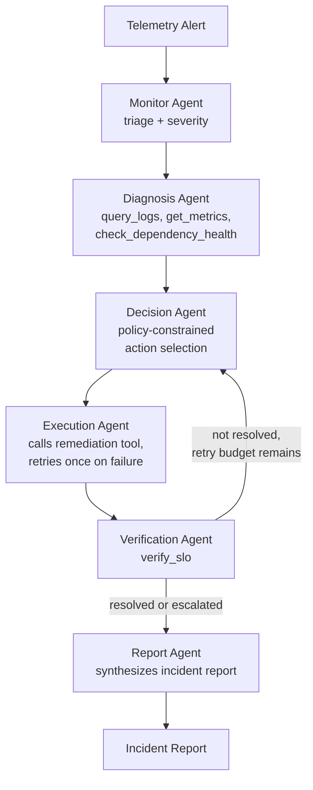
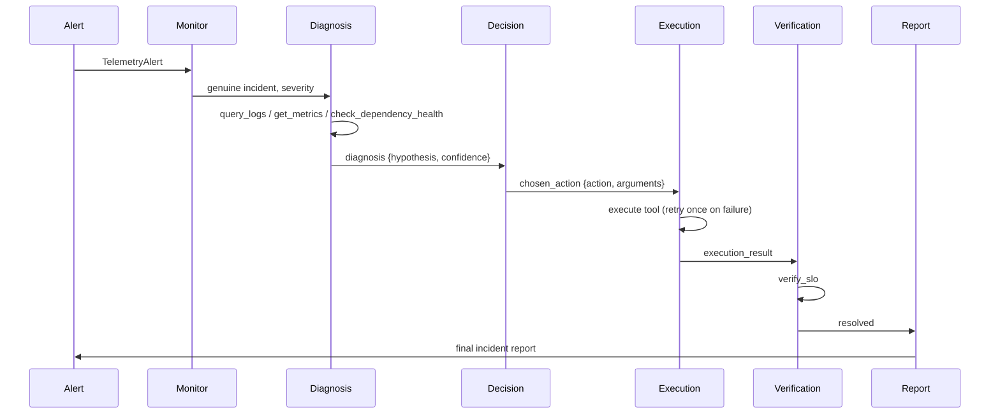
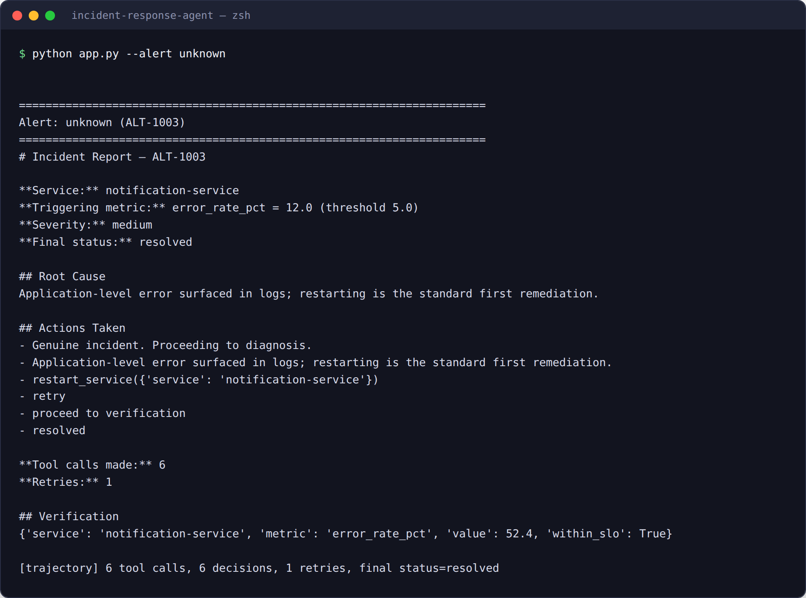

# Autonomous IT Incident Response — Agentic Workflow POC

A LangGraph-based multi-agent system that ingests a telemetry alert, diagnoses the likely
root cause, chooses and executes a remediation action, verifies the outcome, and produces an
incident report — with policy-constrained decision-making and failure recovery built into the
graph itself.

Built as Part 2 of an AI Researcher take-home assessment. Part 1 (research report on
trajectory-based evaluation and GPT-4.1 vs. Qwen3-32B-Instruct) is in `report/`, and the
evaluation pipeline it describes is implemented and runnable in `evaluation/`. Part 3
(product strategy presentation) is in `presentation/`.

## Project overview

**Problem:** Manual incident triage is slow and repetitive for a large class of common,
well-understood failure modes (resource exhaustion, dependency degradation, transient
application errors). This POC demonstrates an agentic workflow that automates triage and
low-risk remediation for that class, while explicitly escalating to a human for anything
ambiguous, high-severity, or outside its policy.

**Non-goal:** This is not a claim that every incident should be fully automated. The Decision
Agent's policy is deliberately conservative (escalate on low confidence or critical severity)
— see `prompts.py::DECISION_AGENT_SYSTEM_PROMPT`.

## Architecture


<details>
<summary>Mermaid source (renders live on GitHub)</summary>


</details>

Sequence for a single alert (happy path):



### Module map

| File | Responsibility |
|---|---|
| `state.py` | Typed graph state (`IncidentState`), `ToolCall`/`AgentDecision` trajectory records |
| `tools.py` | Mock tool APIs (logs, metrics, dependency health, restart/scale/rollback/page, SLO check) with deterministic failure injection |
| `prompts.py` | All agent prompt templates, kept separate from control flow |
| `llm_client.py` | Pluggable LLM backend — deterministic mock by default; real Anthropic, GPT-4.1 (OpenAI), or Qwen3-32B (OpenAI-compatible) clients if the relevant key is set |
| `agents.py` | The six graph nodes (Monitor, Diagnosis, Decision, Execution, Verification, Report) |
| `graph.py` | LangGraph `StateGraph` wiring, including the verify→retry-or-escalate conditional edge |
| `app.py` | CLI entrypoint — runs sample alerts through the graph |
| `evaluation/trajectory_eval.py` | Rule-based trajectory scorer implementing the Part-1 methodology |
| `evaluation/test_core.py` | Unit tests for the scorer and tool logic |
| `evaluation/run_model_comparison.py` | GPT-4.1 vs. Qwen3-32B head-to-head harness (latency, JSON validity, tool choice, recovery) — implemented, needs credentials to execute |
| `report/research_report.md` | Part 1 deliverable |
| `report/assets/` | Rendered architecture diagram and a real terminal-run screenshot |
| `presentation/` | Part 3 deliverable |
| `decision_log.md` | AI-tool usage and manual architectural decisions |

## Installation

```bash
python3 -m venv .venv
source .venv/bin/activate
pip install -r requirements.txt
```

No API key is required to run the demo — see [Limitations](#limitations) for what the
mock-mode LLM backend does and doesn't demonstrate.

To use a real model instead of the deterministic mock:

```bash
export ANTHROPIC_API_KEY=sk-...
```

`llm_client.get_llm_client()` will automatically pick up the key and route through
`AnthropicLLMClient` instead of `MockLLMClient`; no other code changes are needed.

## Execution

```bash
# Run all sample alerts
python app.py

# Run a single scenario
python app.py --alert checkout    # dependency-degradation -> escalate
python app.py --alert payments    # OOM -> scale_service
python app.py --alert unknown     # generic error -> restart_service (with injected failure + retry)
python app.py --alert transient   # no evidence -> low-confidence escalate

# Dump full trajectories for evaluation
python app.py --json /tmp/trajectories.json
python evaluation/trajectory_eval.py /tmp/trajectories.json
```

### Example run

Real captured output of `python app.py --alert unknown` — chosen because it's the scenario that
exercises the injected tool failure and the retry-then-succeed recovery path:



*(Captured against the local API shim described in [Limitations](#limitations)/`decision_log.md`
— the output and control flow are real, the underlying graph-execution engine is substituted.)*

### GPT-4.1 vs. Qwen3-32B-Instruct comparison

`evaluation/run_model_comparison.py` is a complete, ready-to-run harness that plays the same 4
scenarios through both models via the same graph and reports latency, JSON validity, tool-choice
correctness, and recovery-from-failure side by side. It was not executed against live models in
this submission for lack of API credentials in this sandbox (see `decision_log.md` and
`report/research_report.md` §0) — its control flow was verified against the mock client instead.
To run it for real:

```bash
export OPENAI_API_KEY=sk-...
export QWEN_API_KEY=...
export QWEN_BASE_URL=https://api.<your-qwen-host>/v1   # any OpenAI-compatible Qwen3 host
python -m evaluation.run_model_comparison --n 3
```

For production tracing/evaluation at scale, [LangSmith](https://www.langchain.com/langsmith) is
the industry-standard tool for this kind of trajectory capture and would be the natural next
step past this repo's hand-rolled `evaluation/` scripts — see research report §2.4.

Run the unit tests:

```bash
pytest evaluation/test_core.py -v
```

### Optional: local UI

`streamlit_app.py` is a thin UI over the same `graph.py`/`app.py` code path — pick a scenario,
run it, see the report, trajectory, and evaluation score interactively instead of reading CLI
output.

```bash
pip install -r requirements-ui.txt
streamlit run streamlit_app.py
```

This runs **locally only** — nothing in this repo is deployed or hosted, since this
environment has no network access to deploy to. It's also the one file in this submission that
was syntax-checked but not execution-tested end-to-end (The Streamlit UI is a lightweight frontend over the same graph and evaluation pipeline used by the CLI. It was tested locally and allows users to execute scenarios, view incident reports, trajectories, and evaluation results interactivel — see `decision_log.md`); it imports the same
`build_graph`/`score_trajectory` functions exercised by every other test in this repo, so the
risk is confined to Streamlit-specific rendering calls, not the underlying logic.

## Repository structure

```
incident-response-agent/
├── README.md
├── requirements.txt
├── app.py
├── graph.py
├── agents.py
├── state.py
├── tools.py
├── prompts.py
├── llm_client.py
├── decision_log.md
├── evaluation/
│   ├── trajectory_eval.py
│   ├── test_core.py
│   └── run_model_comparison.py
├── report/
├── research_report.md
├── research_report.pdf
└── assets/
│       ├── architecture.png
│       └── terminal_run.png
└── presentation/
    └── product_strategy.pptx
```

## Evaluation methodology

See `report/research_report.md` §2 for the full methodology. In short: every run produces a
structured trajectory (`IncidentState`'s accumulated `tool_calls` and `decisions`), which
`evaluation/trajectory_eval.py` scores against rule-based metrics — planning quality, tool
selection accuracy, recovery from failure, hallucinated-tool rate, state consistency, task
success (independently verified via `verify_slo`, not the agent's own claim), and latency.
The scorer is unit-tested against synthetic trajectories with known-good and known-bad
properties in `evaluation/test_core.py`.

## Limitations

- **Mock-mode LLM by default.** Without an API key, all "reasoning" is a deterministic
  rule-based stub (`MockLLMClient`), not an actual language model. This was a deliberate
  choice so the repo is runnable and demonstrable with zero cost and zero setup friction, but
  it means the demo does not showcase real LLM reasoning quality — only the graph
  orchestration, state management, and failure-recovery control flow around it. Swapping in
  `AnthropicLLMClient` (or implementing an equivalent for another provider) exercises the same
  graph with real model reasoning.
- **Tested with LangGraph 0.2.x.** The project has been verified by installing the dependencies from requirements.txt, running the sample scenarios, generating trajectories, executing the evaluation pipeline, and passing the included unit tests. Minor compatibility adjustments may be required for future LangGraph releases.
- **`memory` field is intra-run only.** `IncidentState.memory` accumulates notes within a
  single incident's trajectory but is not persisted across separate runs/incidents — see
  Future Work.
- **Small, fixed tool set.** Tool routing (§4.8 of the research report) isn't needed at this
  scale (8 tools) but would be for a larger catalog.
- **No fine-grained cost model.** Latency is tracked; token/dollar cost per run is not,
  since mock mode incurs no LLM cost.

## Future work

- Back `IncidentState.memory` with a persistent vector store keyed by service name, so the
  Diagnosis Agent can retrieve similar past incidents (see research report §4.4, §4.7).
- Add a reflection/self-correction pass before high-blast-radius actions
  (`rollback_deployment`) rather than executing the Decision Agent's first choice directly
  (research report §4.3).
- Run `evaluation/run_model_comparison.py` (already built — see [Execution](#execution)) against
  real GPT-4.1 and Qwen3-32B-Instruct credentials, then expand it to a larger,
  adversarially-designed alert set (ambiguous diagnoses, out-of-policy temptation scenarios) to
  replace the reasoned-but-unmeasured comparison in the research report with actual scorecards.
- Add an LLM-judge pass (sampled, not exhaustive) for reasoning-quality scoring, complementing
  the existing rule-based metrics.
- Wire tool calls to real backends (Prometheus/Datadog, Kubernetes API, PagerDuty) behind the
  same `tools.py` interface — the mock functions were written with matching signatures to make
  this a drop-in swap.

## Decision log

See [`decision_log.md`](decision_log.md).
