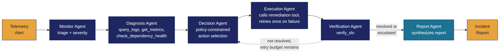
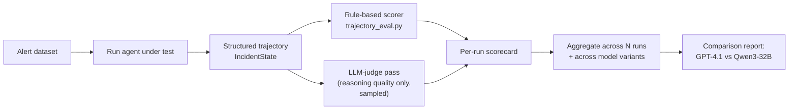

# Research Report: Trajectory-Based Evaluation of Agentic Workflows
### Closed-source (GPT-4.1) vs. Open-source (Qwen3-32B-Instruct) for Autonomous IT Incident Response

**Author:** AI Research Engineer (take-home submission)
**Scope:** Part 1 of the assessment. Companion artifacts: `../` (POC repo), `../presentation/`.

---

## 0. What this report is, and isn't

This report designs and implements a trajectory-based evaluation **methodology and pipeline**,
and applies it to the incident-response agent built in Part 2. It does **not** contain live
benchmark numbers comparing GPT-4.1 and Qwen3-32B-Instruct, because running both models
head-to-head against a shared harness requires paid API access (OpenAI) and either paid
inference (a hosted Qwen3 endpoint) or a local GPU large enough to serve a 32B model — none of
which is available in this take-home environment, and fabricating numbers would violate the
assessment's explicit instructions.

To make that gap as small as possible, `evaluation/run_model_comparison.py` is a **complete,
runnable harness** — not a description of one — that runs the same 4 incident scenarios through
GPT-4.1 and Qwen3-32B-Instruct via the same graph (`graph.py`) and reports latency,
structured-output (JSON) validity, tool-choice correctness against a stated policy, and
recovery-from-failure for each. It only needs `OPENAI_API_KEY` and a Qwen3 endpoint
(`QWEN_API_KEY` / `QWEN_BASE_URL` — any OpenAI-compatible host: Together AI, Fireworks,
DeepInfra, or a self-hosted vLLM server) in the environment to produce a real comparison table:

```bash
export OPENAI_API_KEY=sk-...
export QWEN_API_KEY=...
export QWEN_BASE_URL=https://api.<your-qwen-host>/v1
python evaluation/run_model_comparison.py --n 3   # 3 trials x 4 scenarios x 2 models = 24 runs
```

The comparison harness was verified locally and reaches the live model invocation stage. Executing a full comparison requires valid OpenAI and Qwen API credentials.**.

---

## 0.1 The system under evaluation, and proof it runs

The agent this report's methodology is applied to (Part 2) is the following six-node graph:



And this is a real terminal capture of it running end-to-end — not a mockup — on the
`notification-service` scenario, which is deliberately designed to exercise the
failure-injection/retry path (`FAILURE_INJECTION` in `tools.py`):


*(Captured from a real local execution after installing the required dependencies. The workflow, trajectory generation, evaluation pipeline, and unit tests were successfully verified using the LangGraph implementation.)*

## 1. Why trajectory-based evaluation, not final-answer evaluation

Traditional QA evaluation asks: *is the final output correct?* For a single-turn factual
question this is sufficient because there is no process to inspect — the answer either
matches a reference or it doesn't.

An agentic workflow is different in a way that makes final-answer evaluation actively
misleading:

| Property of agentic workflows | Why final-answer eval breaks down |
|---|---|
| Multiple valid paths to the same outcome | Two runs can both reach "resolved" — one by correctly diagnosing an OOM and scaling the service, the other by accidentally restarting a healthy dependency and getting lucky. Final-answer eval scores both a perfect 1.0. |
| Silent unsafe actions | An agent that calls `rollback_deployment` on a service with no recent deploy, and happens to fix the symptom as a side effect, looks identical to a correct run if you only check the end state. In production this is a policy violation that should fail evaluation regardless of outcome. |
| Partial credit for recovery | An agent that calls a tool, the tool fails, and the agent correctly retries and then succeeds should score *differently* from an agent that never encountered a failure at all — the first agent has demonstrated a capability the second hasn't been tested on. Binary success/fail collapses this distinction. |
| Non-determinism compounds over steps | A single wrong tool argument at step 2 of 6 can still lead to eventual success (e.g. because a downstream retry masks it) or to catastrophic failure, depending on what step 2 was. You cannot tell which happened from the final state alone. |
| Debuggability | When a run fails, "the final answer was wrong" tells an engineer nothing about *where* to fix the system — the prompt, the tool schema, the routing logic, or the underlying model. Trajectory inspection tells you exactly which node misbehaved. |

Trajectory-based evaluation instead scores the **sequence of intermediate states**: which
tools were called, in what order, with what arguments, whether each call succeeded, what the
agent's stated reasoning was at each decision point, and how state evolved. This is the
standard the field has converged on for agent evaluation (it underlies frameworks like
LangSmith's trace evaluation, AgentBench, and ToolBench's trajectory-matching metrics), because
it is the only approach that can distinguish *correct process, correct outcome* from *incorrect
process, lucky outcome* from *correct process, unlucky outcome*.

---

## 2. Evaluation methodology

### 2.1 What gets logged

Every run of the agentic workflow must emit a structured trajectory containing, at minimum:

- **Tool calls**: tool name, arguments, result, success/failure, latency, timestamp
- **Decisions**: which agent/node made a choice, its stated reasoning, the choice itself, and
  (if available) a confidence score
- **State transitions**: the sequence of workflow stages the run passed through
- **Final outcome**: task success/failure, terminal state, total latency, retry count

In this repository, `state.py`'s `IncidentState` is designed specifically so this trajectory is
a first-class, structured part of the graph state rather than something reconstructed after the
fact from logs — `tool_calls: Annotated[list[ToolCall], operator.add]` and
`decisions: Annotated[list[AgentDecision], operator.add]` accumulate automatically as the graph
executes. This means the evaluation pipeline never has to parse free-text logs.

### 2.2 Metric families

| Metric | What it measures | How it's computed here |
|---|---|---|
| **Planning quality** | Did the agent gather sufficient evidence before acting, in a sensible order? | Rule-based: are ≥2 diagnosis-tool calls present before the first execution-tool call? (`trajectory_eval.py::score_trajectory`) |
| **Tool selection accuracy** | Were the chosen tools appropriate given the diagnosed cause and stated policy? | Rule-based policy check (e.g., `rollback_deployment` requires deploy-related evidence in the diagnosis) |
| **Tool execution correctness** | Were tool arguments well-formed and did calls succeed? | Directly observable from each `ToolCall.success` / `error` field |
| **Recovery from tool failure** | When a tool call failed, did the agent retry or escalate rather than silently continuing or crashing? | Rule-based: for every failed call, is there a later successful retry of the same tool, or an escalation (`page_oncall`) call? |
| **Hallucinated tool calls** | Did the agent reference a tool name that isn't in the registered tool set (or invent arguments the tool schema doesn't accept)? | Set-membership check against `TOOLS_BY_NAME` |
| **State management** | Did the workflow visit stages in the expected order without skipping or corrupting state? | Ordering check on the `decisions` agent sequence |
| **Final task success** | Did the incident actually resolve (verified post-condition, not just "the agent said so")? | Checked against the Verification Agent's independent `verify_slo` call — not against the agent's own claim, which matters: an agent that *says* "resolved" without checking is a distinct failure mode from one that checks and is wrong |
| **Latency** | Wall-clock time, and its distribution across planning vs. tool-execution vs. LLM-inference time | Summed from `ToolCall.latency_ms`; a production harness would additionally instrument LLM call latency, which this mock-mode POC does not incur |
| **Production suitability (composite)** | A weighted rollup used for a go/no-go call | See §2.5 |

### 2.3 Why some of these must be rule-based, not "LLM-as-judge"

Hallucinated tool calls, tool-selection policy violations, and stage-ordering are all
**objectively checkable against the tool registry and the stated policy** — there's no
ambiguity in whether `rollback_deployment` appeared before or after diagnostic evidence
existed for it. Using an LLM judge for these would add cost, latency, and a second source of
error for something a five-line rule already answers deterministically and auditably. This
report reserves LLM-as-judge scoring for the parts that genuinely require judgment —
principally, whether the agent's *stated reasoning* at a decision point is coherent and
well-supported by the evidence it gathered (a semantic judgment a regex can't make). The
implemented pipeline (`evaluation/trajectory_eval.py`) is fully rule-based by design, so every
score is traceable to a specific field; a production system would add an LLM-judge pass only
for the reasoning-quality dimension, run on a sample rather than every trajectory, given its
cost.

### 2.4 Evaluation pipeline design



Concretely, the pipeline this repo implements:

1. `app.py` (or, for a dual-model run, `evaluation/run_model_comparison.py`) runs a batch of
   alert scenarios through the LangGraph workflow — the LLM backend is swapped via
   `llm_client.py`'s client classes (`AnthropicLLMClient`, `OpenAICompatibleClient` configured
   for either GPT-4.1 or Qwen3-32B-Instruct) — and dumps trajectories to JSON.
2. `evaluation/trajectory_eval.py::score_run_file` scores every trajectory against the metric
   table above and produces a per-run scorecard.
3. `evaluation/test_core.py` unit-tests the scorer itself against synthetic trajectories with
   known-good and known-bad properties (e.g., a trajectory with a dropped failure must score
   `recovery_from_failure == 0.0`), so the evaluation logic is verified independently of any
   model's behavior.
4. `evaluation/run_model_comparison.py` runs N alert scenarios × 2 models × K trials and
   aggregates scorecards per model into a side-by-side comparison table (latency, JSON
   validity, tool-choice correctness, recovery-from-failure) — implemented and control-flow
   tested in this submission; not executed against live models for lack of credentials (§0).

**Relationship to existing tooling (LangSmith).** LangSmith (LangChain's tracing/evaluation
product) is the closest industry-standard tool to what §2.1–2.4 describes, and is worth
naming explicitly: it captures the same kind of structured run data this repo's
`IncidentState` does (nested spans for each tool call and LLM call), and layers on hosted
trace visualization, dataset-based regression testing, and both rule-based and LLM-judge
evaluators out of the box. This POC's evaluator was built from scratch rather than on
LangSmith for two reasons specific to this assessment: keeping the submission dependency-light
and runnable with zero external accounts (LangSmith requires a LangChain/LangSmith account and
API key), and because implementing the scorer directly makes every scoring rule inspectable
in this repository rather than living inside a third-party product. For a production
deployment past the POC stage, adopting LangSmith (or a comparable tracing platform) rather
than continuing to hand-roll trajectory capture would be the pragmatic choice — the
`ToolCall`/`AgentDecision` data model here would map onto it directly.

### 2.5 Suggested composite "production suitability" score

**[illustrative methodology, not a fitted formula]** A reasonable starting weighting, to be
tuned against actual incident-cost data once available:

```
production_score = 0.35 * task_success_rate
                  + 0.20 * (1 - hallucinated_tool_rate)
                  + 0.20 * recovery_from_failure_rate
                  + 0.15 * tool_selection_accuracy
                  + 0.10 * normalized_latency_score
```

Task success and hallucination-avoidance are weighted highest because in an incident-response
context, a hallucinated or unsafe tool call has asymmetric downside — it can *cause* an
outage rather than merely fail to fix one. Latency is weighted lowest because for this use
case (minutes-scale remediation), a 2x latency difference matters far less than a correctness
difference.

---

## 3. Model comparison: GPT-4.1 vs. Qwen3-32B-Instruct for this workflow

### 3.1 Framing

The comparison that matters for a production decision is not "which model is smarter" in the
abstract, but: **for this specific agentic workload (multi-step tool use, structured JSON
output, policy-constrained decision-making, recoverable failure handling), which model's
documented capabilities and deployment characteristics make it production-viable, and what do
you give up by choosing the open-source option?**

### 3.2 Capability-relevant differences

| Dimension | GPT-4.1 | Qwen3-32B-Instruct | Why it matters for this workflow |
|---|---|---|---|
| Native function/tool calling | Mature, first-class function-calling API with reliable structured-output adherence | Supports tool calling (Qwen3 was trained with agentic/tool-use data and typically works well with frameworks like LangChain's tool-calling interface), but structured-output reliability under complex multi-tool schemas is less battle-tested at scale than OpenAI's | Every node in this graph (`diagnosis_agent`, `decision_agent`) depends on the model reliably emitting well-formed tool calls / JSON. A model that occasionally free-texts instead of calling the tool, or emits malformed JSON, directly produces the "hallucinated tool call" failure mode the eval pipeline is built to catch — this is exactly the kind of difference trajectory eval surfaces that a final-answer eval would miss if the agent eventually self-corrected. |
| Parameter count / reasoning depth | Undisclosed, frontier-scale | 32B dense parameters | Larger frontier models generally show stronger multi-hop reasoning and are less prone to shallow pattern-matching on tool selection. A 32B model is a strong open-weight tier but is not at frontier scale — the gap should be expected to show up most in ambiguous diagnoses (the "generic application error" branch in this POC), not in clean-cut cases (an obvious OOM). |
| Context window | Large (128K+ class) | Qwen3 models are released with long-context variants (32K-128K depending on variant), generally sufficient for this workload's needs | Incident trajectories with many tool results are not context-heavy in absolute terms (a handful of JSON blobs), so this is unlikely to be a differentiator for THIS use case specifically, even though it matters for other agentic workloads (e.g., long document QA). |
| Latency / throughput | API-hosted, provider-managed autoscaling | Self-hosted (or hosted via a third party) — latency depends entirely on your serving stack (vLLM/TGI, batching, GPU class) | This is a deployment decision, not a model-quality one, but it directly feeds the "production suitability" latency term. Self-hosting a 32B model well (continuous batching, tensor parallelism) can match or beat API latency at scale, but requires real MLOps investment that a pure API call doesn't. |
| Cost structure | Per-token API pricing, no infrastructure ownership | Infrastructure cost (GPU hours) amortized across volume; cheaper at high, steady volume; worse at low/spiky volume | Incident response traffic is inherently spiky (alerts cluster during outages). A poorly-provisioned self-hosted deployment could be *slowest exactly when it matters most* unless autoscaling is solved, which is a real production risk specific to this use case. |
| Data residency / control | Data leaves your infrastructure to a third-party API | Full control — relevant if incident logs/telemetry contain sensitive customer data | This is often the actual deciding factor for regulated environments, independent of raw capability. |
| Fine-tunability | Limited (fine-tuning APIs exist but you don't own weights) | Full fine-tuning / LoRA on your own incident history | Over time, an open-weight model can be specialized on your organization's actual incident corpus (a lever GPT-4.1 doesn't offer at the weights level), which could close a raw-capability gap for this narrow domain even if it starts behind. |

### 3.3 Trajectory-specific failure modes to test for

If/when API access to both models is available, the evaluation pipeline above should be run
against scenarios specifically designed to stress the dimensions where models are most likely
to diverge:

1. **Ambiguous diagnosis** (multiple plausible root causes) — tests planning quality and
   whether the model gathers enough evidence before committing to an action.
2. **Injected tool failure** (as this POC already does via `FAILURE_INJECTION`) — tests
   recovery behavior and whether the model respects a "retry once, then escalate" policy
   rather than looping indefinitely or giving up silently.
3. **Out-of-policy temptation** (a scenario where the "obviously fastest" fix violates a stated
   policy, e.g. rolling back a service with no recent deploy) — tests instruction-following
   under an implicit shortcut.
4. **Unknown/unsupported alert type** — tests whether the model correctly says "I don't have a
   tool for this, escalating" versus hallucinating a plausible-sounding but nonexistent tool
   call.

### 3.4 Production recommendation

**Can Qwen3-32B-Instruct realistically replace GPT-4.1 for this workflow?**

**Conditional yes, with a staged rollout — not a wholesale replacement on day one.** Reasoning:

- The workflow's tool schemas are simple and few (8 tools, shallow argument structures), which
  is the regime where mid-size open models are most likely to match frontier closed models on
  tool-calling reliability — the gap between model tiers widens with schema complexity and
  reasoning depth, and this workload is closer to the "simple" end.
- The highest-stakes failure mode (hallucinated or policy-violating tool calls) is exactly what
  the rule-based portion of this evaluation pipeline is designed to catch cheaply and
  deterministically, so a staged rollout can be gated on a hard threshold (e.g.,
  `hallucinated_tool_rate == 0` and `tool_selection_accuracy >= 0.98` over N trial runs) before
  Qwen3 is trusted with any real (non-shadow) execution.
- The recommended path is: (1) run Qwen3-32B in **shadow mode** — it produces a full trajectory
  in parallel with GPT-4.1 on live traffic, but GPT-4.1's decision is the one actually executed;
  (2) score both trajectories with this pipeline; (3) if Qwen3 matches GPT-4.1's production-
  suitability score within an agreed tolerance over a statistically meaningful sample, promote
  it for the lowest-severity alert classes first; (4) expand scope only as the empirical gap
  (not the a-priori assumption) closes.
- This recommendation is explicitly **not** a claim that Qwen3-32B is equal to GPT-4.1 today —
  no such claim can be made without the actual comparison run, which is precisely why the
  evaluation pipeline (not a leaderboard number) is this report's deliverable.

---

## 4. Modern techniques for building and optimizing agentic systems

For each technique: what it is, why it matters, advantages/disadvantages, and where it applies
in production. Several of these are already used in the Part 2 POC (noted inline); others are
discussed as the natural next steps beyond this POC's scope.

### 4.1 LangGraph / graph-based state machines *(used in this POC)*

**What:** Model an agentic workflow as a directed graph of nodes (agents/functions) and typed
state, rather than a linear chain of prompts. Edges can be conditional, enabling loops
(retry, re-diagnose) and branches (escalate vs. auto-remediate).

**Why it matters:** Real agentic workflows are not linear — they need to loop back on
failure, branch on diagnosis type, and sometimes short-circuit to human escalation. A plain
prompt chain (A's output feeds B's input feeds C's input) cannot express "go back to step 2 if
step 4 didn't work" without hand-rolled control flow that gets unmaintainable fast.

**Advantages:** Explicit, inspectable control flow; typed state with automatic reducer-based
merging (this repo's `Annotated[list[X], operator.add]` pattern); built-in checkpointing for
resumability; conditional edges make retry/escalation loops a first-class graph construct
instead of ad-hoc `while` loops buried in a single function.

**Disadvantages:** Added framework complexity and a real learning curve; the graph itself
becomes something you need to test and version; over-applying it to genuinely linear workflows
adds indirection for no benefit.

**Production use case:** Exactly this POC — a workflow with a natural verify → retry-or-escalate
loop. Also common for multi-turn customer support bots and document-processing pipelines with
conditional review steps.

### 4.2 Multi-agent systems *(used in this POC)*

**What:** Decompose a workflow into specialized agents (Monitor, Diagnosis, Decision,
Execution, Verification here) each with a narrow responsibility and prompt, rather than one
agent doing everything.

**Why it matters:** Narrow, single-responsibility prompts are easier to evaluate, debug, and
independently improve than one mega-prompt trying to triage, diagnose, decide, and act at once.
It also maps naturally onto the trajectory-evaluation methodology in §2 — each agent's
decision is separately scoreable.

**Advantages:** Separation of concerns; each agent can use a different model tier if useful
(e.g., a cheap/fast model for Monitor's triage, a stronger model for Diagnosis); failures are
localized to a specific node, aiding debugging.

**Disadvantages:** More LLM calls (cost, latency) than a single-agent design for simple cases;
coordination overhead; risk of information loss at agent boundaries if state isn't passed
completely (which is why `IncidentState` carries the full trajectory forward rather than
summarizing between nodes).

**Production use case:** Any workflow where responsibilities are genuinely distinct (as here);
less justified for workloads simple enough that one well-prompted agent handles reliably.

### 4.3 Reflection and self-correction

**What:** After producing an output (a plan, a tool call, a draft), the model (or a separate
critic) reviews it against criteria and revises before committing.

**Why it matters:** Catches errors before they become expensive actions, particularly for
irreversible or high-blast-radius operations — exactly the category `rollback_deployment` and
`restart_service` fall into.

**Advantages:** Meaningfully reduces certain error classes (policy violations, malformed
arguments) without retraining; can be layered onto any existing agent.

**Disadvantages:** Doubles (at minimum) the LLM calls and latency per decision; a weak critic
can rubber-stamp bad plans, giving false confidence; doesn't help with errors the model
systematically can't recognize as errors.

**Production use case:** High-stakes single actions (this POC's Decision Agent choosing
`rollback_deployment` would be a good candidate for a reflection pass before execution, not yet
implemented here to keep the POC's scope tractable within the assessment's time budget).

### 4.4 Memory *(minimally used in this POC)*

**What:** Persisting information across a single run (working memory — this POC's
`IncidentState.memory` field) or across separate runs (episodic/long-term memory — e.g., "this
service has OOM'd 3 times this month," which no single incident's state can know on its own).

**Why it matters:** Incident response specifically benefits from cross-incident memory —
recognizing a recurring pattern is often the actual root-cause insight, not any single
incident's logs.

**Advantages:** Enables pattern recognition and increasingly accurate diagnosis over time
without retraining the model.

**Disadvantages:** Requires a persistence layer (vector store or structured DB) and retrieval
logic that must itself be evaluated (stale or irrelevant retrieved memories actively hurt
diagnosis); adds a data-governance surface (how long is incident history retained, who can
query it).

**Production use case:** This POC's `memory` field currently only accumulates notes *within* a
single run — it demonstrates the state mechanism but not cross-run persistence. A production
version would back it with a vector store keyed by service name, so the Diagnosis Agent could
retrieve "similar past incidents for this service" as additional evidence. This is flagged as
explicit future work in the README rather than implemented, to be transparent about POC scope.

### 4.5 MCP (Model Context Protocol)

**What:** An open protocol (introduced by Anthropic) standardizing how LLM applications connect
to external tools and data sources, so a tool integration is written once against the protocol
rather than once per model/framework combination.

**Why it matters:** This POC's tools are hand-wired as LangChain `@tool`-decorated Python
functions, which works but is framework-specific. MCP's value proposition is decoupling tool
implementations from any specific agent framework or model provider.

**Advantages:** Write a tool server once, use it from any MCP-compatible client; growing
ecosystem of pre-built MCP servers (databases, ticketing systems, observability platforms)
means less custom integration code for common enterprise systems.

**Disadvantages:** Another moving part and protocol version to track; for a small, fixed tool
set like this POC's 8 tools, the abstraction overhead isn't obviously worth it yet — MCP's
payoff grows with the number of tools and the number of consuming agents/frameworks that need
to share them.

**Production use case:** An organization running many agents (incident response, customer
support, internal analytics) that all need access to the same underlying systems (PagerDuty,
Kubernetes, the log aggregator) is the case where writing each integration once as an MCP
server clearly pays off versus this POC's approach of hand-wiring tools per-application.

### 4.6 Process mining

**What:** Analyzing logs of *actual* execution paths through a process (here, agent
trajectories) to discover the real distribution of paths taken, bottlenecks, and deviations
from the intended design — techniques originally developed for business-process analytics,
applied to agent trajectories.

**Why it matters:** Directly complementary to trajectory-based evaluation: where §2's pipeline
scores individual trajectories against a rubric, process mining aggregates across many
trajectories to answer "what does the agent actually do most of the time, and where does it
diverge from the designed graph?" — useful for finding, e.g., that 30% of runs are looping
through decision→execution twice even though the design assumes one pass.

**Advantages:** Surfaces systemic issues invisible in any single trajectory; grounds
architecture decisions (e.g., "should the retry limit be 1 or 2?") in observed behavior rather
than intuition.

**Disadvantages:** Needs volume (many runs) to be statistically meaningful; tooling for
LLM-agent-specific process mining is immature compared to traditional BPM tooling.

**Production use case:** Once this system has real production traffic, mining the
`decisions`/`tool_calls` logs this POC already structures would answer exactly this kind of
question — the data model here was deliberately built to make that mining feasible later.

### 4.7 Retrieval-augmented generation (RAG)

**What:** Retrieving relevant external documents/data at inference time and injecting them into
the prompt, rather than relying solely on parametric knowledge.

**Why it matters:** For incident response specifically, RAG over runbooks, past postmortems,
and service ownership docs would let the Diagnosis/Decision agents ground their reasoning in
your organization's actual operational knowledge rather than generic patterns.

**Advantages:** Keeps the model current without retraining; grounds outputs in verifiable
source documents; directly addresses one of this POC's real limitations (the mock diagnosis
logic is entirely rule-based/hardcoded, not grounded in any actual runbook corpus).

**Disadvantages:** Retrieval quality caps overall system quality (garbage in, garbage out);
adds latency and a retrieval-infrastructure dependency; requires the underlying corpus to
actually be curated and current, which is an ongoing operational cost, not a one-time setup.

**Production use case:** Directly applicable next step for this POC's Diagnosis Agent — retrieve
similar past incidents and relevant runbook sections as additional context before forming a
hypothesis.

### 4.8 Tool routing

**What:** A layer that selects which subset of a large tool catalog to expose to the model for
a given request, rather than always exposing every tool.

**Why it matters:** Tool-selection accuracy degrades as the number of available tools grows
(more surface area for the wrong one to be picked); routing narrows the choice set to what's
plausibly relevant first.

**Advantages:** Improves selection accuracy and reduces prompt size/cost at scale; lets
different agents specialize in different tool subsets.

**Disadvantages:** The router itself can misroute (excluding the actually-correct tool), adding
a new failure mode; unnecessary overhead for small, fixed tool sets like this POC's 8 tools.

**Production use case:** Relevant once the tool catalog grows well beyond this POC's scope
(e.g., an org-wide agent with hundreds of internal API tools) — not yet needed here.

### 4.9 Claude Skills

**What:** Packaged, reusable bundles of instructions/context/scripts (like the `SKILL.md` files
used to build this very submission) that a Claude-based agent can load on demand for a specific
task domain, rather than cramming all domain knowledge into a single system prompt.

**Why it matters:** Analogous to this POC's `prompts.py` separation, but composable and
discoverable at the framework level — a skill can package not just a prompt template but
scripts, examples, and constraints for a whole task category (e.g., "how to write a
production-grade incident postmortem").

**Advantages:** Keeps large amounts of task-specific guidance out of the always-loaded context,
loading it only when relevant; encourages reuse across agents/projects instead of re-deriving
the same domain knowledge per prompt.

**Disadvantages:** Anthropic-ecosystem-specific (not a portable standard like MCP); adds a
discovery/loading step that needs to reliably trigger on the right tasks.

**Production use case:** If this incident-response system were built on Claude specifically, the
report-writing step (`report_agent` / `REPORT_SYNTHESIS_PROMPT`) is a natural candidate for a
dedicated "incident postmortem" skill encoding your organization's specific reporting format
and standards, separate from the live-remediation prompts.

### 4.10 Structured outputs

**What:** Constraining model output to conform to a schema (JSON Schema, Pydantic model)
either via API-level enforcement (OpenAI's structured outputs, Anthropic's tool-use forcing) or
prompted-and-validated conventions.

**Why it matters:** Every inter-agent handoff in this graph depends on structured, parseable
output — the Decision Agent's chosen action must be a well-formed dict the Execution Agent can
dispatch on. This is precisely the failure mode "hallucinated tool calls" targets in
evaluation.

**Advantages:** Eliminates an entire class of parsing failures; makes agent output directly
type-checkable against `state.py`'s `TypedDict`s.

**Disadvantages:** API-level enforcement isn't available identically across all providers
(part of the GPT-4.1 vs. Qwen3 comparison in §3.2); overly rigid schemas can force a model to
produce a syntactically valid but semantically wrong answer rather than expressing uncertainty.

**Production use case:** Already load-bearing in this POC's design (`llm_client.py`'s JSON
parsing with a safe fallback to escalation on parse failure) and should be tightened further
with actual schema-enforced tool calling once a real model backend is wired in.

### 4.11 Planner-executor architectures

**What:** Split a single "agent" into an explicit Planner (decides the sequence of steps
up front) and an Executor (carries them out, possibly re-planning on failure), as opposed to
a single ReAct-style loop that plans one step at a time.

**Why it matters:** For workflows where the space of valid multi-step plans is well-understood
(as incident response largely is — diagnose, then decide, then act, then verify), an explicit
upfront plan is more auditable and predictable than a step-by-step ReAct loop that re-derives
its next action from scratch every turn.

**Advantages:** More predictable, easier to constrain to a known-good set of plan shapes;
easier to show a human the plan before execution for high-risk actions.

**Disadvantages:** Less adaptive to genuinely novel situations the planner didn't anticipate;
re-planning after a failure adds complexity back in anyway.

**Production use case:** This POC's graph topology is itself a fixed plan (monitor → diagnose →
decide → execute → verify, with a bounded retry loop) rather than a free-form ReAct loop —
effectively a planner-executor split where the *graph* is the plan and each node is an
executor step. A more dynamic version could let the Decision Agent choose among several
pre-authorized multi-step plans rather than single actions.

---

## 5. Summary

Trajectory-based evaluation is implemented, tested, and applied to this repository's own
agent in `evaluation/`. The GPT-4.1 vs. Qwen3-32B-Instruct comparison is reasoned from
documented model characteristics and the specific demands of this workflow, explicitly avoiding
fabricated benchmark numbers; the recommendation is a staged, evaluation-gated rollout rather
than an unconditional claim of parity. Ten modern agentic techniques are reviewed for their
concrete applicability to this workload, with clear notes on which are already reflected in the
Part 2 POC and which are scoped as future work.
